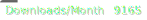
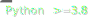
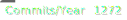

# Magnetismi

Magnetism (Finnish: magnetismi) - another opinionated World Magnetic Model calculator.

## Model

### References 

\[WMM20]
:    "The US/UK World Magnetic Model for 2020-2025: Technical Report", Personal Author(s) : Chulliat, A.;W. Brown;P. Alken;C. Beggan;M. Nair;G. Cox;A. Woods;S. Macmillan;B. Meyer;M. Paniccia; 
Corporate Authors(s) : National Centers for Environmental Information (U.S.);British Geological Survey; Published Date : 2020, DOI : https://doi.org/10.25923/ytk1-yx35

### Interface to the Source Data

The mode in use is the current World Magnetic Model from 2020 \[[WMM20](https://www.ngdc.noaa.gov/geomag/WMM/data/WMM2020/WMM2020_Report.pdf)\] with is considered valid through 2025. 
For information on the state of the geomagnetic field the latest report is per [December 2021](https://www.ngdc.noaa.gov/geomag/WMM/data/WMMReports/WMM_Annual_Report_2021.pdf)
The corresponding coefficient file is per [WMM2020COF.zip](https://www.ngdc.noaa.gov/geomag/WMM/soft.shtml#).
The COF file format is documented on the page [WMM coefficient file format for developers](https://www.ngdc.noaa.gov/geomag/WMM/wmmformat.shtml) including example code to read the coefficients. 

### The Magnetic Elements

Citing the model report \[WMM20] section 1.1.1:
>The geomagnetic field vector, Bm, is described by seven elements. These are the northerly intensity X, the easterly intensity Y, the vertical intensity Z (positive downwards) and the following quantities derived from X, Y and Z: the horizontal intensity H, the total intensity F, the inclination angle I, (also called the dip angle and measured from the horizontal plane to the field vector, positive downwards) and the declination angle D (also called the magnetic variation and measured clockwise from true north to the horizontal component of the field vector). In the descriptions of X, Y, Z, H, F, I and D above, the vertical direction is perpendicular to the WGS 84 ellipsoid model of the Earth, the horizontal plane is perpendicular to the vertical direction, and the rotational directions clockwise and counter-clockwise are determined by a view from above \[...]
>
>The quantities X, Y and Z are the sizes of perpendicular vectors that add vectorially to Bm. Conversely, X, Y and Z can be determined from the quantities F, I and D (i.e., the quantities that specify the size and direction of Bm).

#### Ranges of the Magnetic Element Values

The below table depicts the expected value ranges of the magnetic field elements (Source: \[[WMM20](https://www.ngdc.noaa.gov/geomag/WMM/data/WMM2020/WMM2020_Report.pdf)\] table 1 in section 1.1.1):

| Element | Name                 | Alternative Name    | Range and unit at Earth’s Surface | Directional Hint |
|:-------:|:-------------------- |:------------------- |:--------------------------------- |:---------------- |
|    X    | North component      | Northerly intensity | \[-17000, 43000\] nT              | North            |
|    Y    | East component       | Easterly intensity  | \[-18000, 17000\] nT              | East             |
|    Z    | Down component       | Vertical intensity  | \[-67000, 62000\] nT              | Down             |
|    H    | Horizontal intensity |                     | \[0, 43000\] nT                   |                  |
|    F    | Total intensity      | Total field         | \[23000, 67000\] nT               |                  |
|    I    | Inclination          | Dip                 | \[-90, 90\] Degree                | Down             |
|    D    | Declination          | Magnetic variation  | \[-180, 180\] Degree              | East / Clockwise |
|    GV   | Grid Variation       | Grivation           | \[-180, 180\] Degree              | East / Clockwise |

## Bug Tracker

Any feature requests or bug reports shall go to the [todos of magnetismi](https://todo.sr.ht/~sthagen/magnetismi).

## Primary Source repository

The main source of `magnetismi` is on a mountain in central Switzerland.
We use distributed version control (git).
There is no central hub.
Every clone can become a new source for the benefit of all.
The preferred public clone of `magnetismi` is:

* [at sourcehut](https://git.sr.ht/~sthagen/magnetismi) - a collection of tools useful for software development.

## Contributions

Please do not submit "pull requests" (I found no way to disable that "feature" on GitHub).
If you like to share small changes under the repositories license please kindly do so by sending a patchset.
You can either send such a patchset per email using [git send-email](https://git-send-email.io) or 
if you are a sourcehut user by selecting "Prepare a patchset" on the summary page of your fork at [sourcehut](https://git.sr.ht/).

## Support

Please kindly submit issues at <https://todo.sr.ht/~sthagen/magnetismi> or write plain text email to <~sthagen/magnetismi@lists.sr.ht> to submit patches and request support. Thanks.
